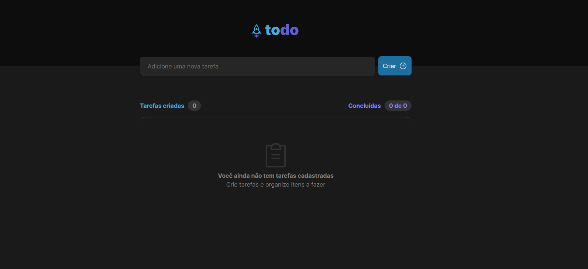

# todo-list

## :rocket: Sobre

O todo-list é uma desafio feito pela rocketseat com o objetivo de praticar o conceito básicos do react como - Estados - Imutabilidade do estado - Listas e chaves no ReactJS - Propriedades - Componentização.

## Preview

##To run the project on your local machine:

1 - Clone the project:
  git clone https://github.com/Andersonsilvamota/todo-list.git
  
2 - Access the folder:
  cd todo-list

3 - Install the dependencies:
  npm i
  
4- Start the project:
  npm run dev
